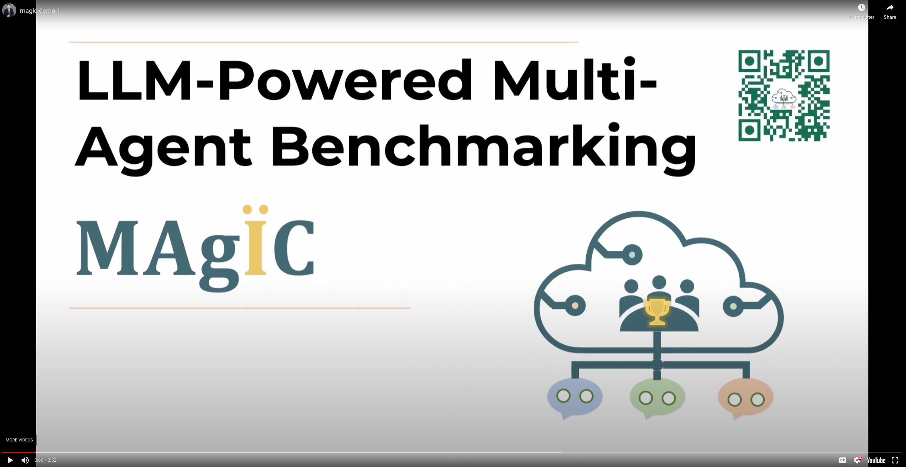

<!-- Improved compatibility of back to top link: See: https://github.com/othneildrew/Best-README-Template/pull/73 -->


<a name="readme-top"></a>


<!-- PROJECT SHIELDS -->
<!--
*** I'm using markdown "reference style" links for readability.
*** Reference links are enclosed in brackets [ ] instead of parentheses ( ).
*** See the bottom of this document for the declaration of the reference variables
*** for contributors-url, forks-url, etc. This is an optional, concise syntax you may use.
*** https://www.markdownguide.org/basic-syntax/#reference-style-links
-->

<!-- [![LinkedIn][linkedin-shield]][linkedin-url] -->
<!-- :magic_wand: -->
<!-- $\ddot{a}$ 🪄-->

<div align="center">
<a href="https://zhiyuanhubj.github.io/MAgIC/">
    
</a>

<h2 align="center">

MAgIC: Investigation of Large Language Model Powered Multi-Agent in Cognition, Adaptability, Rationality and Collaboration</h2>
  <p align="center">
    A competition-based benchmark with quantitative metrics for Large Language Model Powered Multi-agent system.
    <br />
    <a href="https://github.com/cathyxl/MAgIC/issues">🐛 Report Bug</a>
    ·
    <a href="https://zhiyuanhubj.github.io/MAgIC/">📃 Main Page</a> ·
    <a href="https://arxiv.org/abs/2311.08562">📖 Paper</a>
    <a href="https://arxiv.org/abs/2311.08562"> 📊 Leaderboard</a>
  </p>
</div>

[![Contributors][contributors-shield]][contributors-url]
[![Forks][forks-shield]][forks-url]
[![Stargazers][stars-shield]][stars-url]
[![Issues][issues-shield]][issues-url]
[![MIT License][license-shield]][license-url]

<!-- https://youtu.be/R5MCYf3mVKI -->
<!-- https://www.youtube.com/embed/iNqq75Uf57M -->
<!-- [](https://www.youtube.com/embed/iNqq75Uf57M) -->
<div align="center" width="600" height="1200" ><a href="https://www.youtube.com/embed/iNqq75Uf57M" title="MAgIC Demo"></a></div>


## 📌 MAgIC Benchmark News 🎉🔥


<!-- TABLE OF CONTENTS -->

<!-- [![Product Name Screen Shot][tease]]() -->
<!-- <details>
  <Summary>Table of Contents</Summary>
  <ol>
    <li>
      <a href="#about-the-project">About The Project</a>
    </li>
    <li>
      <a href="#getting-started">Getting Started</a>
      <ul>
        <li><a href="#prerequisites">Prerequisites</a></li>
        <li><a href="#installation">Installation</a></li>
      </ul>
    </li>
    <li><a href="#usage">Usage</a></li>
    <li><a href="#roadmap">Roadmap</a></li>
    <li><a href="#license">License</a></li>
    <li><a href="#contact">Contact</a></li>
  </ol>
</details> -->

<!-- ABOUT THE PROJECT -->
## About The Project
### Scenarios
MAgIC provides a benchmark that can quantitatively measure the abilities of Cognition, Adaptability, Rationality and Collaboration of Large Language Models within multi-agent sytems. Our benchmark are based competition on 5 scenarios:
- Chameleon
- Undercover
- Cost Sharing
- Prisoner' Dilemma
- Public Good

### PGM-Aware Agent Structure
[![ghaha][pgm]]()
### Evaluation Metrics and Game Win Rate
[![Product Name Screen Shot][tease]]()


<p align="right">(<a href="#readme-top">back to top</a>)</p>


## Leaderboard
We have tested 10 models in our benchmark, and the PGM method we proposed has achieved a remarkable improvement.
[![Product Name Screen Shot][leaderboard]]()
## Getting Started

### Installation
1. Environment preparation
```
# conda virtual environment
conda create -n magic_llm python=3.9
conda activate magic_llm
 
# or python3 virtual environment
mkdir magic_llm
python3 -m venv magic_llm
source magic_llm/bin/activate
```
2. Install required environments
```
pip3 install -r requirements.txt
```
### Run competition and evaluation
1. Get your own OpenAI API Key, and set \$openai_api_key\$
```
export OPENAI_API_KEY=$openai_api_key$
```
2. Run experiments and calculate metrics. Now this code verson only support openai models, if you want to test your own LLMs, please refer to our leaderboard website to test your LLM and upload your results.
```
python3 arena_runner.py
```


<p align="right">(<a href="#readme-top">back to top</a>)</p>


<!-- ROADMAP -->
## Roadmap

- [x] Upload relevant code
- [x] Add link to Leaderboard website
- [x] Introduce more scenarios and LLM results
- [ ] Add Online Demo where human and various LLMs can play together


<p align="right">(<a href="#readme-top">back to top</a>)</p>


<!-- LICENSE -->
## License

Distributed under the MIT License. See `LICENSE.txt` for more information.

<p align="right">(<a href="#readme-top">back to top</a>)</p>


<!-- CONTACT -->
## Contact

Lin Xu- [@Lin_Xu_](https://twitter.com/twitter_handle) - cathyxl2016@gmail.com


<p align="right">(<a href="#readme-top">back to top</a>)</p>


<p align="right">(<a href="#readme-top">back to top</a>)</p>

## Citation
```
@article{xu2023magic,
      title={MAgIC: Benchmarking Large Language Model Powered Multi-Agent in Cognition, Adaptability, Rationality and Collaboration}, 
      author={Lin Xu and Zhiyuan Hu and Daquan Zhou and Hongyu Ren and Zhen Dong and Kurt Keutzer and See Kiong Ng and Jiashi Feng},
      year={2023},
      journal={arXiv preprint arXiv: 2311.08562}
}
```


<!-- MARKDOWN LINKS & IMAGES -->
<!-- https://www.markdownguide.org/basic-syntax/#reference-style-links -->
[contributors-shield]: https://img.shields.io/github/contributors/cathyxl/MAgIC.svg?style=for-the-badge
[contributors-url]: https://github.com/cathyxl/MAgIC/graphs/contributors
[forks-shield]: https://img.shields.io/github/forks/cathyxl/MAgIC.svg?style=for-the-badge
[forks-url]: https://github.com/cathyxl/MAgIC/network/members
[stars-shield]: https://img.shields.io/github/stars/cathyxl/MAGIC.svg?style=for-the-badge
[stars-url]: https://github.com/cathyxl/MAgIC/stargazers
[issues-shield]: https://img.shields.io/github/issues/cathyxl/MAgIC.svg?style=for-the-badge
[issues-url]: https://github.com/cathyxl/MAgIC/issues
[license-shield]: https://img.shields.io/github/issues/cathyxl/MAgIC.svg?style=for-the-badge
[license-url]: https://github.com/cathyxl/MAgIC/blob/master/LICENSE.txt
[linkedin-shield]: https://img.shields.io/badge/-LinkedIn-black.svg?style=for-the-badge&logo=linkedin&colorB=555
[linkedin-url]: https://linkedin.com/in/linkedin_username
[tease]: imgs/tease_horizontal.jpg
[demo]: https://youtu.be/Vi0PlphNtSA
[pgm]: imgs/pgm.jpg
[logo]: imgs/logo.png
[leaderboard]: imgs/leaderboard.png
[Next.js]: https://img.shields.io/badge/next.js-000000?style=for-the-badge&logo=nextdotjs&logoColor=white
[Next-url]: https://nextjs.org/
[React.js]: https://img.shields.io/badge/React-20232A?style=for-the-badge&logo=react&logoColor=61DAFB
[React-url]: https://reactjs.org/
[Vue.js]: https://img.shields.io/badge/Vue.js-35495E?style=for-the-badge&logo=vuedotjs&logoColor=4FC08D
[Vue-url]: https://vuejs.org/
[Angular.io]: https://img.shields.io/badge/Angular-DD0031?style=for-the-badge&logo=angular&logoColor=white
[Angular-url]: https://angular.io/
[Svelte.dev]: https://img.shields.io/badge/Svelte-4A4A55?style=for-the-badge&logo=svelte&logoColor=FF3E00
[Svelte-url]: https://svelte.dev/
[Laravel.com]: https://img.shields.io/badge/Laravel-FF2D20?style=for-the-badge&logo=laravel&logoColor=white
[Laravel-url]: https://laravel.com
[Bootstrap.com]: https://img.shields.io/badge/Bootstrap-563D7C?style=for-the-badge&logo=bootstrap&logoColor=white
[Bootstrap-url]: https://getbootstrap.com
[JQuery.com]: https://img.shields.io/badge/jQuery-0769AD?style=for-the-badge&logo=jquery&logoColor=white
[JQuery-url]: https://jquery.com 
